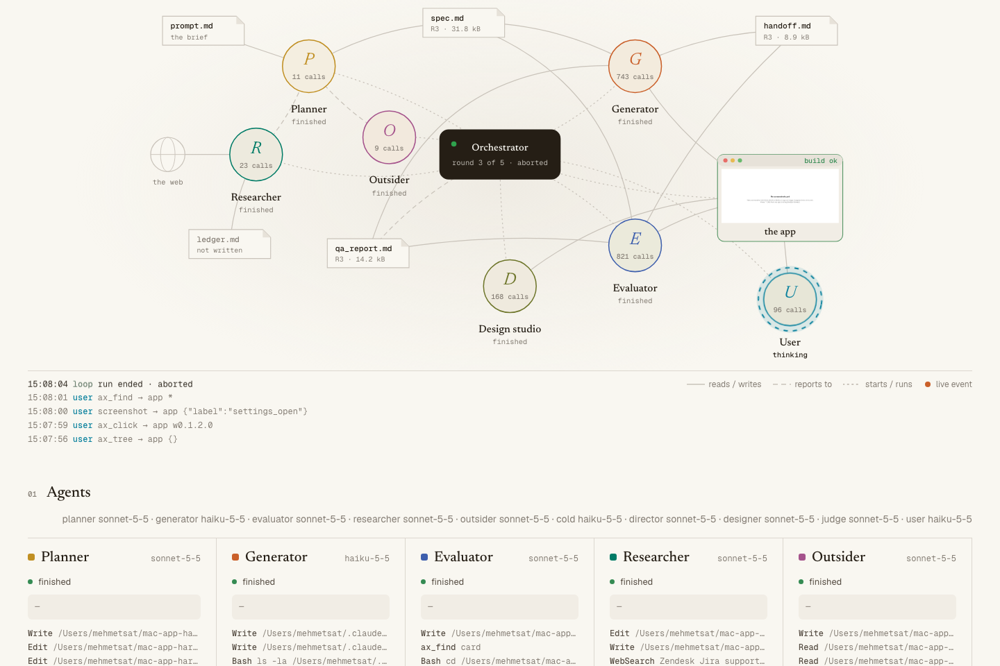
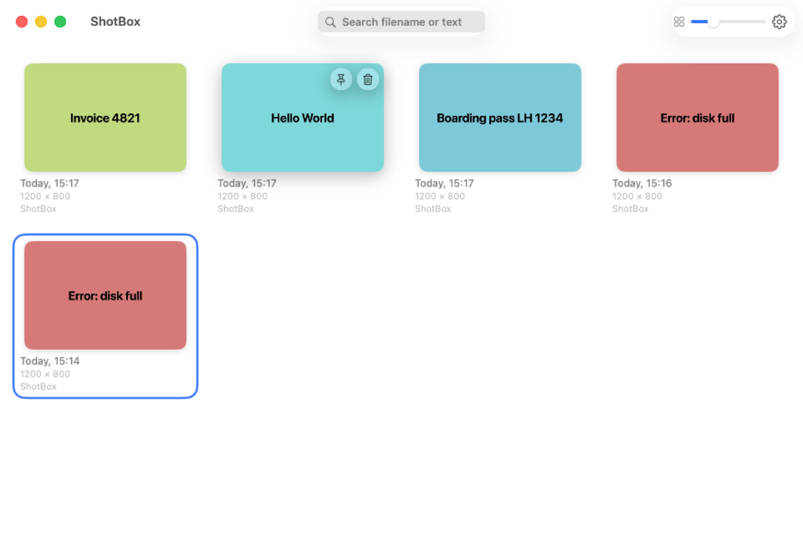
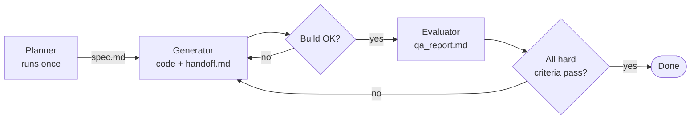
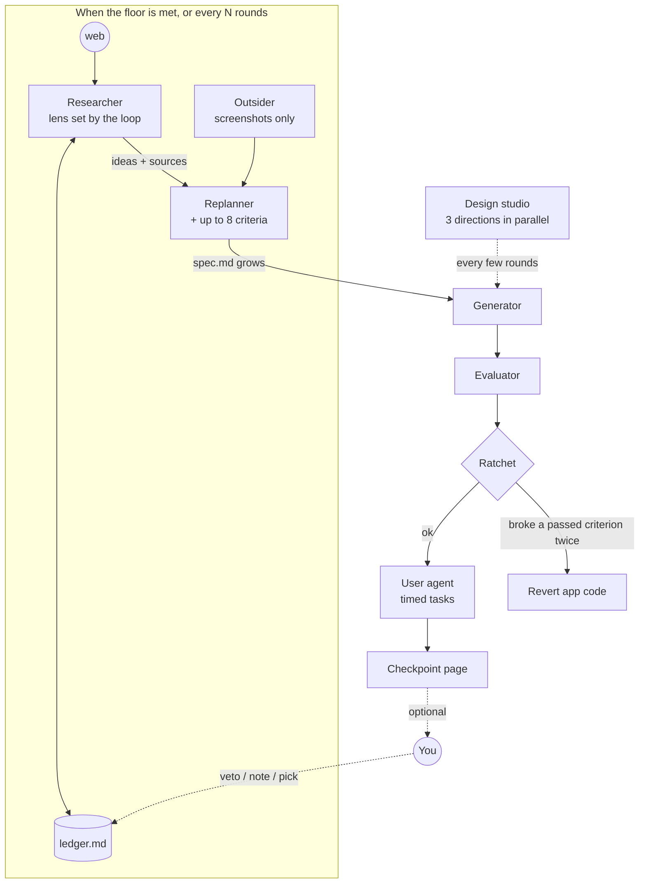
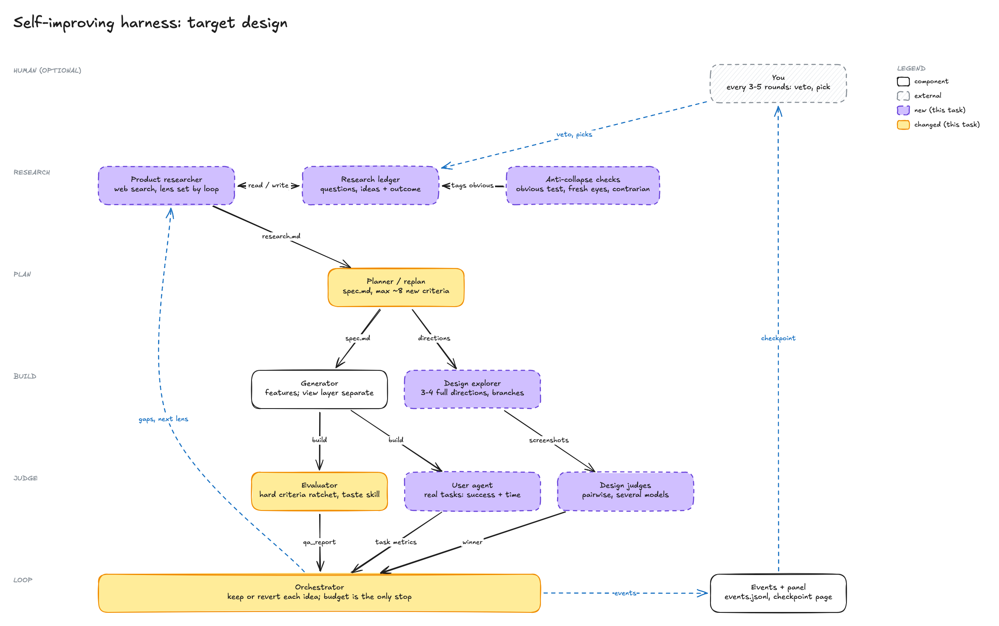
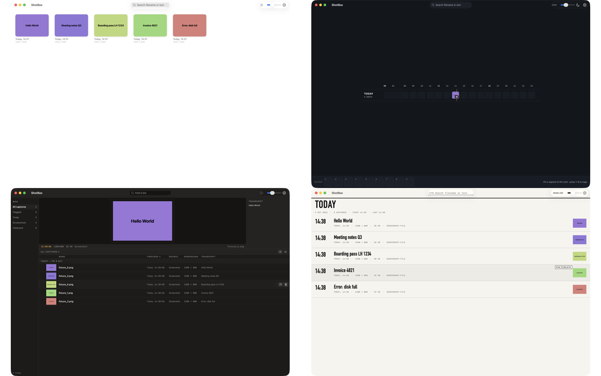

<div align="center">

# Nightsmith

**A self-improving agent harness that builds macOS apps while you sleep.**
**The spec is a floor, not a ceiling.**

[](LICENSE)




</div>

Nightsmith runs a team of Claude agents in a loop. They plan a Mac app, build it, test it through the
accessibility tree and real screenshots, and fix what QA finds. That part is a classic
planner → generator → evaluator harness.

The second part is the point. When every criterion passes, most harnesses stop. Nightsmith treats
that as the floor: a researcher searches the web for what the best tools (and unrelated fields) do,
an outsider looks at the app with fresh eyes, and the planner raises the bar. A ratchet makes sure
nothing that worked ever breaks for good. A design studio tries three very different redesigns in
parallel and lets judges pick. A test user times real tasks. You check in every few rounds if you
want to. The loop never waits for you.

The test subject is **ShotBox**, a menubar app that keeps every screenshot, makes them searchable by
the text inside them (Vision OCR), and copies them back with one click.

<p align="center"></p>

---

## Contents

- [Why](#why)
- [How it works](#how-it-works)
- [Results so far](#results-so-far)
- [Quick start](#quick-start)
- [Watching a run](#watching-a-run)
- [Repository layout](#repository-layout)
- [Lessons learned](#lessons-learned)
- [Limits and next steps](#limits-and-next-steps)
- [Credits](#credits)

## Why

A planner writes a spec once. Every later round only closes the gap to that spec, so the product can
never be better than the planner's first guess. Asking one model to "do better" does not fix this
either: research on the same topic with the same model tends to land on the same ideas.

Nightsmith tries to break both limits:

1. **No ceiling.** Passing the spec starts a new round of research and a higher bar.
2. **No collapse.** The loop, not the model, picks the research angle, draws a random far-away
   field for analogies, and tags ideas that a model with no context would suggest anyway.
3. **No human bottleneck.** A human can veto, comment or pick a design at any time. Nothing waits.

It is also an experiment in **watching** agents work: one event stream feeds a live panel that shows
which agent is running which tool, who reports to whom, and what every round cost.

## How it works

### The core loop (`run.ts`)



Agents never call each other. They read and write files; a plain TypeScript loop decides what runs
next. The evaluator drives the real app through [`tools/axcli`](tools/axcli), a small Swift CLI
over the macOS accessibility API, plus window screenshots and frame capture for motion.

### The self-improving loop (`evolve.ts`)



<p align="center"></p>

| Part | What it does |
|---|---|
| **Researcher** | Searches the web (`WebSearch`, `WebFetch`) through a lens the loop rotates: a specific user, user complaints, HCI research, software history, keyboard-only, accessibility and more. Must cite a URL for every claim. |
| **Forced analogy** | Each round draws a far-away field at random (film editing bins, air traffic control strips, herbarium sheets…) and the researcher must take one idea from it. |
| **Obvious test** | A cold model with no context lists the 30 improvements any team would make. Ideas that overlap get tagged *obvious*; at least half of each replan must be *new*. |
| **Ledger** | Every question, query, source and idea so far. The researcher may not repeat one. Outcomes (built, reverted, vetoed) are recorded too. |
| **Outsider** | Sees only screenshots, never the plans. Writes a fresh-eyes review, then argues against the current direction. |
| **Spec guard** | The replanner may append criteria, never edit or delete them. The loop restores any change. |
| **Ratchet** | A hard criterion that passed once must keep passing. One round to fix a regression, then the app code is reverted to the last good commit. Suspected regressions are first re-tested on that commit, so a bug QA simply missed before does not trigger a revert. |
| **Design studio** | A director writes three far-apart directions (inspiration × constraint, drawn by the loop). Three designers build them in parallel git worktrees. A photographer captures the same screens of each; two judges (craft, character) compare every pair. The winner is merged only if it beats the current design. |
| **User agent** | A small model with only the mac tools does six realistic tasks ("find the invoice screenshot and copy it"). The loop times them and checks the outcome with a shell command. Tasks that used to work and now fail go back to the generator. |
| **Budget** | The only planned stop. Above 90% of the 5-hour usage window the loop waits for the reset; a locked screen pauses it until unlock. |

<p align="center"><br>
<sub>One design round. Top left: the current design. The others: "Hotbar and Days" (video game inventories, time as the main axis), "Reel and Bin" (film editing bins, almost no colour), "Scoreboard" (sports video analysis, typography first).</sub></p>

## Results so far

Generator on Claude Haiku 5.5, evaluator, researcher and judges on Sonnet 5.5. Costs are the Agent
SDK's own estimates at list prices; on a Claude subscription they come out of the usage limits.

| Run | Loop | Rounds | Hard criteria | Time | Cost |
|---|---|---|---|---|---|
| `run1` | classic | 2 | 26/28 → **28/28**, stops | 53 min | $10.25 |
| `evo1` | self-improving | 3 | 27/28 → 26/28 → **32/35** (+8 criteria from research, one redesign) | 1 h 36 min | $22.03 |
| user tasks | on `evo1`'s build | – | **4/6** tasks done in 6–16 steps; the two failures are real usability gaps QA had also flagged | 4 min | $0.30 |

Criteria the research added that were not in the original brief, all traced to a source idea:
the capture's source app on every card; ticket ids, URLs and error codes found by OCR as clickable
chips; search results that show *why* they matched; a preview of which captures retention will
delete next; a keyboard-only find-and-copy flow.

## Quick start

**Needs:** macOS 14+, Xcode 16+ (for the Swift toolchain), Node 22.18+ (runs TypeScript directly),
`ffmpeg`, and a Claude login (Claude Code) or an `ANTHROPIC_API_KEY`.

```bash
git clone https://github.com/mehmetsat/nightsmith.git && cd nightsmith
brew install ffmpeg
(cd tools/axcli && swift build -c release)
(cd orchestrator && npm install)
```

Give the terminal app that runs the harness **Accessibility** and **Screen & System Audio
Recording** in System Settings → Privacy & Security, then check:

```bash
tools/axcli/.build/release/axcli check
```

Run the loop:

```bash
cd orchestrator

# a 2-round smoke test on a one-button app, all on Haiku
node run.ts --prompt ../prompts/trivial.md --app-name Counter --max-rounds 2 \
  --models planner=haiku,generator=haiku,evaluator=haiku

# the classic loop on ShotBox, with the trimmed 28-criteria spec
node run.ts --prompt ../prompts/shotbox.md --spec ../prompts/shotbox.spec.md --run-id run1

# the self-improving loop, continuing from run1's app
node evolve.ts --from-run run1 --run-id night1 --max-rounds 20 --budget-usd 60
```

Useful `evolve.ts` flags: `--replan-every 3`, `--max-new-criteria 8`, `--design-every 4`,
`--design-directions 3`, `--checkpoint-every 4`, `--window-cap 0.9`, `--no-design`, `--no-tasks`.

> [!IMPORTANT]
> Keep the screen **unlocked** during a run. On a locked screen window screenshots still work, but
> every accessibility tree comes back empty, so nothing can be tested. Nightsmith keeps the display
> awake with `caffeinate` and pauses if you lock it.

## Watching a run

The panel starts with every run at <http://127.0.0.1:4317>. For old runs: `node panel/server.ts`.

- **Flow:** agents, handoff files, the web and the app as a graph. A particle travels along an edge for every real event: a `Write spec.md`, a screenshot coming back from the app, a QA verdict reporting to the orchestrator. **Replay** any finished run at 20×, 60× or 200×.
- **Timeline** of every tool call per agent, **criteria matrix** (pass/fail per round, with what changed), **spend** per agent per round, **tool usage**, a **screenshot strip** with lightbox, all handoff files with diffs, and a filterable **event log**.

To steer a running loop, write lines into `runs/<run_id>/feedback.md`:

```text
veto I-3-2: too gimmicky
note: focus on the keyboard flow next
pick design r3-3
```

Every `--checkpoint-every` rounds a summary lands in `runs/<run_id>/checkpoints/`.

## Repository layout

```
orchestrator/
  run.ts          classic loop
  evolve.ts       self-improving loop: replan, ratchet, checkpoints, feedback
  harness.ts      shared: workspace, git, agents, budget, screen lock, summary
  design.ts       design studio: directions, parallel worktrees, judges
  usertasks.ts    timed user tasks with shell-checked outcomes
  criteria.ts     criteria parsing, QA verdicts, the spec guard
  events.ts       Agent SDK stream → one event shape → JSONL + SQLite
  agents/         prompts, lenses and analogy fields, mac tools (MCP), agent runner
  panel/          live panel (one HTML file + SSE server)
tools/
  axcli/          Swift CLI: tree, find, click, type, key, window-id, pbimage, pbinfo, fixture
  screenshot.sh   PNG of the app window only
  record_frames.sh  records the window, returns N evenly spaced frames
app-template/     build.sh, run.sh, init.sh copied into each run's workspace
prompts/          the briefs: trivial.md, shotbox.md (+ trimmed spec, test env)
docs/             the original handoff brief, diagrams, images
runs/<run_id>/    (git-ignored) events, raw SDK output, screenshots, the app workspace
```

Each run's app lives in `runs/<run_id>/app/`, its own git repo. The agents treat it as their whole
world.

## Lessons learned

Most of these came from real runs going wrong. Each is fixed in the code.

- **Your own Claude setup leaks into every agent.** By default the Agent SDK loads user settings,
  `CLAUDE.md`, skills and claude.ai connectors. Connector tool definitions alone added ~140k tokens
  to every request: a one-command Haiku call went from $0.0004 to $0.17. Agents here run with
  `settingSources: []` and `strictMcpConfig: true`.
- **Streamed usage is stale.** Assistant frames under-report output tokens. Each agent's final event
  carries a correction to the SDK's total, so per-round costs add up exactly.
- **Keep event payloads small and keep the ids.** Cutting a big payload whole once dropped
  `tool_use_id`, so tool calls could not be paired with their results.
- **Send input to the app, not the system.** Global key events type into whatever app is in front.
  `axcli` posts to the target process by default. For the one case that must be global, real
  modifier key-up events are sent too: without them, cmd and alt stayed logically held system-wide
  and later clicks arrived as ctrl-clicks.
- **Path ids shift; identifiers do not.** `w0.3.1` changes when the UI changes. Prefer
  `@accessibilityIdentifier`; the generator is told to add one to every control.
- **A locked screen breaks testing silently.** Screenshots keep working, the accessibility tree goes
  empty. Check for that, not just the lock flag, and throw away any QA taken during a lock.
- **"Could not verify" is not "broken".** A strict evaluator rightly fails what it could not check,
  but a ratchet that reverts on that throws away good work. QA now marks each fail as `bug` or
  `unverified`, and only bugs can trigger a revert.
- **QA is not deterministic.** A deeper session finds a bug an earlier one passed. That looks like a
  regression. Suspects are re-tested on the last good commit first.
- **A redesign must respect the spec.** The winning layout once replaced a required grid, and the
  generator had to put it back in the same round. Designers now read the criteria first.
- **Real files arrive new.** A watch-folder app ignored files that existed before launch, files moved
  back in with `mv` (a rename) and files copied with `cp -p` (old date). Task setup now copies them
  in fresh after launch.
- **Agents must not touch the machine.** The evaluator once switched system appearance to test dark
  mode. All prompts now forbid system-wide changes; anything that needs one becomes a manual criterion.

## Limits and next steps

- `Bash` is not sandboxed. Write and Edit are limited per agent, but a shell can reach anything.
- During QA the app comes to the front, Preview opens, and global hotkeys fire. Use a spare Mac or
  user account for long runs.
- Taste is judged by models. A taste skill for the judges and your own picks as examples are next.
- A run on Opus 5.5 against the same spec, for a quality comparison.
- Not yet checked in a full run: the regression re-test and the checkpoint feedback loop.

## Credits

Inspired by two Anthropic engineering posts:
[Harness design for long-running application development](https://www.anthropic.com/engineering/harness-design-long-running-apps)
and [Effective harnesses for long-running agents](https://www.anthropic.com/engineering/effective-harnesses-for-long-running-agents).
The original brief is in [docs/handoff-brief.pdf](docs/handoff-brief.pdf). Built with the
[Claude Agent SDK](https://www.npmjs.com/package/@anthropic-ai/claude-agent-sdk).

## License

[MIT](LICENSE)
