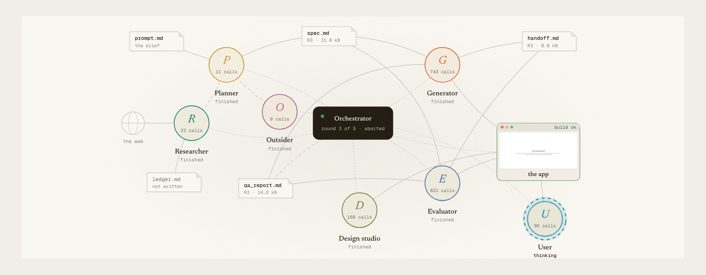
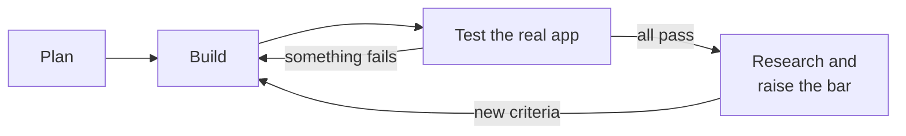
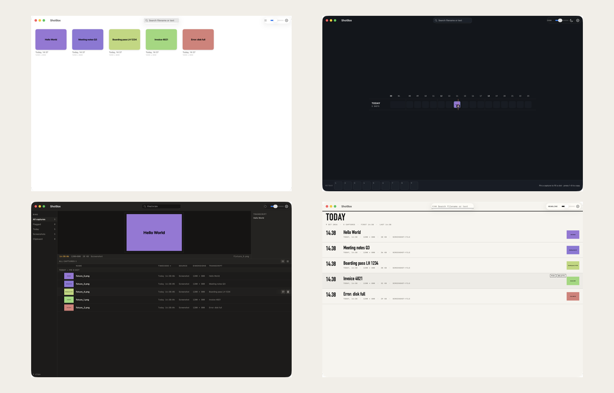
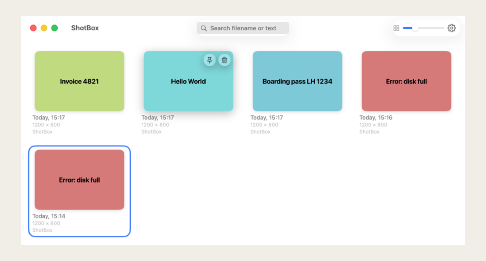

<div align="center">

# Nightsmith

**Agents that build a macOS app overnight, and keep raising the bar.**

[](LICENSE)


<br>



<br>
<br>

</div>

Most agent harnesses stop when the plan is done. That makes the first plan the ceiling.

Nightsmith treats the plan as a **floor**. When everything passes, a researcher searches the web,
an outsider looks at the app with fresh eyes, and the plan grows. What worked once can never break
for good. You can check in whenever you like; the loop never waits for you.

## How it works



- **Build and test.** A generator writes Swift; an evaluator drives the running app through the
  macOS accessibility tree, screenshots and frame capture.
- **Raise the bar.** A researcher searches the web through an angle the loop picks; an outsider
  sees only screenshots. New criteria get added, old ones never get weaker.
- **Stay new.** A cold model lists the obvious ideas; the research has to go past them.
- **Never slip back.** A ratchet reverts code that keeps breaking something that used to work.
- **Try bold designs.** Three very different redesigns are built in parallel; judges pick one.
- **Measure, not guess.** A test user times real tasks, like "find the invoice and copy it".

Details: [docs/HOW-IT-WORKS.md](docs/HOW-IT-WORKS.md).

<br>

<div align="center">

<br>
<sub>One design round: the current design and three directions built in parallel.</sub>
</div>

<br>

## Results

The test app is **ShotBox**: it keeps every screenshot and finds them by the text inside them.

| Run | Rounds | Hard criteria | Cost |
|---|---|---|---|
| Classic loop | 2 | 28/28, then stops | $10 |
| Self-improving loop | 3 | 28 → 35, with a new design | $22 |

The research added ideas that were not in the brief: the source app on every card, ticket ids and
URLs found by OCR as clickable chips, and search results that show why they matched.

<br>

<div align="center">

</div>

<br>

## Quick start

Needs macOS 14+, Xcode 16+, Node 22.18+, `ffmpeg`, and a Claude login or `ANTHROPIC_API_KEY`.

```bash
git clone https://github.com/mehmetsat/nightsmith.git && cd nightsmith
(cd tools/axcli && swift build -c release)
(cd orchestrator && npm install)
```

Give your terminal **Accessibility** and **Screen Recording** permission, then:

```bash
cd orchestrator
node run.ts --prompt ../prompts/shotbox.md --spec ../prompts/shotbox.spec.md --run-id run1
node evolve.ts --from-run run1 --run-id night1 --max-rounds 20 --budget-usd 60
```

Watch it live at <http://127.0.0.1:4317>. Keep the screen unlocked while it runs.

## What I learned

- Your own Claude setup leaks into every agent. Connector tools alone added 140k tokens per call.
- A strict tester fails what it cannot check. A ratchet must not revert on that.
- Testers are not deterministic. Check a "regression" on the old code before reverting.
- On a locked screen, screenshots still work but the accessibility tree is empty.

More in [docs/HOW-IT-WORKS.md](docs/HOW-IT-WORKS.md#lessons-learned).

## Credits

Inspired by Anthropic's
[Harness design for long-running application development](https://www.anthropic.com/engineering/harness-design-long-running-apps)
and [Effective harnesses for long-running agents](https://www.anthropic.com/engineering/effective-harnesses-for-long-running-agents).
Built with the [Claude Agent SDK](https://www.npmjs.com/package/@anthropic-ai/claude-agent-sdk).
The original brief: [docs/handoff-brief.pdf](docs/handoff-brief.pdf).

[MIT](LICENSE)
