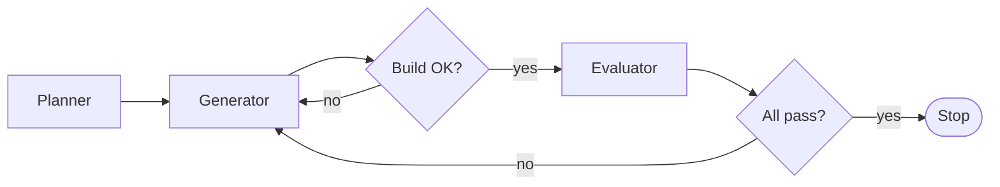

# How Nightsmith works

- [Two loops](#two-loops)
- [The parts](#the-parts)
- [Running it](#running-it)
- [Watching and steering a run](#watching-and-steering-a-run)
- [Repository layout](#repository-layout)
- [Lessons learned](#lessons-learned)
- [Limits](#limits)

## Two loops

**`run.ts`, the classic loop.** A planner writes `spec.md` once. Then a generator and an evaluator
take turns until every hard criterion passes. A broken build goes straight back to the generator.



**`evolve.ts`, the self-improving loop.** The same build and test rounds, but "all pass" starts a
replan instead of stopping. The only planned stop is the budget.

Agents never call each other. They read and write files in the app's workspace; a plain TypeScript
loop decides what runs next.

## The parts

| Part | What it does |
|---|---|
| **Generator** | Writes the Swift app, builds it with `build.sh`, checks its own work with the same tools QA has, writes `handoff.md`, commits. |
| **Evaluator** | Runs the app and checks every criterion through [`tools/axcli`](../tools/axcli) (accessibility tree, clicks, keys), window screenshots and frame capture for motion. Marks each fail as `bug` or `unverified`. |
| **Researcher** | Searches the web (`WebSearch`, `WebFetch`) through a lens the loop rotates: a specific user, user complaints, HCI research, software history, keyboard-only, accessibility and more. Every claim needs a URL. |
| **Forced analogy** | Each replan draws a far-away field at random (film editing bins, air traffic control strips, herbarium sheets…). The researcher must take one idea from it. |
| **Obvious test** | A cold model with no context lists the 30 improvements any team would make. Overlapping ideas are tagged *obvious*; at least half of each replan must be *new*. |
| **Ledger** | Every question, query, source and idea so far, plus what happened to each idea. The researcher may not repeat one. |
| **Outsider** | Sees only screenshots, never the plans. Writes a fresh-eyes review, then argues against the current direction. |
| **Replanner** | Appends up to 8 criteria per replan, each with the idea it came from. |
| **Spec guard** | Existing criteria can never be edited or deleted. The loop restores any change. |
| **Ratchet** | A hard criterion that passed once must keep passing. A suspected regression is first re-tested on the last good commit; only a real one counts. One round to fix it, then the app code is reverted. |
| **Design studio** | A director writes three far-apart directions (an inspiration and a constraint drawn by the loop). Three designers build them in parallel git worktrees. A photographer captures the same screens; two judges (craft, character) compare every pair. The winner is merged only if it beats the current design. |
| **User agent** | A small model with only the mac tools does six realistic tasks. The loop times them and checks the outcome with a shell command. Tasks that used to work and now fail go back to the generator. |
| **Budget** | Above 90% of the 5-hour usage window the loop waits for the reset. A locked screen pauses it until unlock. |

## Running it

```bash
cd orchestrator

# 2-round smoke test on a one-button app, all on Haiku
node run.ts --prompt ../prompts/trivial.md --app-name Counter --max-rounds 2 \
  --models planner=haiku,generator=haiku,evaluator=haiku

# planner only, to review and trim the spec first
node run.ts --prompt ../prompts/shotbox.md --plan-only

# self-improving loop, from scratch or from an earlier run
node evolve.ts --prompt ../prompts/shotbox.md --spec ../prompts/shotbox.spec.md --run-id night1
node evolve.ts --from-run run1 --run-id night2 --max-rounds 20 --budget-usd 60
```

`evolve.ts` flags: `--max-rounds 20`, `--budget-usd 60`, `--window-cap 0.9`, `--replan-every 3`,
`--max-new-criteria 8`, `--design-every 4`, `--design-directions 3`, `--checkpoint-every 4`,
`--no-design`, `--no-tasks`, `--models planner=sonnet,generator=haiku,...`.

Without `ANTHROPIC_API_KEY` the SDK uses your Claude Code login, and usage counts against your
subscription limits. Setting the key switches auth; no code change.

## Watching and steering a run

The panel starts with every run at <http://127.0.0.1:4317>. For old runs: `node panel/server.ts`.

- **Flow:** the agents, handoff files, the web and the app as a graph. A particle moves along an
  edge for each real event. Finished runs can be replayed at 20×, 60× or 200×.
- **Timeline** of every tool call, a **criteria matrix** (pass and fail per round), **spend** per agent
  and round, **tool usage**, a **screenshot strip**, the handoff files with diffs, and an **event log**.

To steer a running loop, write lines into `runs/<run_id>/feedback.md`:

```text
veto I-3-2: too gimmicky
note: focus on the keyboard flow next
pick design r3-3
```

Every few rounds a summary page lands in `runs/<run_id>/checkpoints/`.

## Repository layout

```
orchestrator/
  run.ts          classic loop
  evolve.ts       self-improving loop: replan, ratchet, checkpoints, feedback
  harness.ts      shared: workspace, git, agents, budget, screen lock, summary
  design.ts       design studio
  usertasks.ts    timed user tasks
  criteria.ts     criteria, QA verdicts, the spec guard
  events.ts       Agent SDK stream → one event shape → JSONL + SQLite
  agents/         prompts, lenses, mac tools (MCP), agent runner
  panel/          live panel (one HTML file + SSE server)
tools/
  axcli/          Swift CLI over the accessibility API
  screenshot.sh   PNG of the app window
  record_frames.sh  N evenly spaced frames of the window
app-template/     build.sh, run.sh, init.sh for each run's workspace
prompts/          the briefs
runs/<run_id>/    (git-ignored) events, raw SDK output, screenshots, the app's own git repo
```

## Lessons learned

Most of these came from real runs going wrong. Each one is fixed in the code.

- **Your Claude setup leaks into every agent.** By default the Agent SDK loads your settings,
  `CLAUDE.md`, skills and claude.ai connectors. Connector tool definitions alone added ~140k tokens
  per request: a one-command Haiku call went from $0.0004 to $0.17. Agents here run with
  `settingSources: []` and `strictMcpConfig: true`.
- **Streamed usage is stale.** Assistant frames under-report output tokens. Each agent's last event
  carries a correction to the SDK's total, so costs add up.
- **Keep event payloads small and keep the ids.** Cutting a big payload whole once dropped
  `tool_use_id`, and tool calls could no longer be paired with their results.
- **Send input to the app, not the system.** Global key events type into whatever app is in front.
  When a combo must be global, release the modifier keys too: without that, cmd and alt stayed
  held system-wide and later clicks arrived as ctrl-clicks.
- **Path ids shift.** `w0.3.1` changes when the UI changes. Prefer accessibility identifiers.
- **A locked screen breaks testing quietly.** Screenshots keep working, the accessibility tree goes
  empty. Check for that, and throw away QA taken during a lock.
- **"Could not verify" is not "broken".** A strict tester rightly fails what it could not check, but
  a ratchet that reverts on that throws away good work. Only seen bugs may trigger a revert.
- **Testers are not deterministic.** A deeper session finds a bug an earlier one passed, which looks
  like a regression. Re-test suspects on the last good commit first.
- **A redesign must respect the spec.** A winning table layout once replaced a required grid.
  Designers now read the criteria first.
- **Test files must arrive new.** A watch-folder app ignored files that existed before launch,
  files moved back with `mv`, and files copied with `cp -p`. A plain `cp` after launch works.
- **Agents must not touch the machine.** The evaluator once switched system appearance to test dark
  mode. The prompts now forbid system-wide changes.

## Limits

- `Bash` is not sandboxed. Write and Edit are limited per agent; a shell can reach anything.
- During QA the app comes to the front, Preview opens and global hotkeys fire. A spare Mac or user
  account is best for long runs.
- Taste is judged by models. A taste skill for the judges is next.
- Not yet checked in a full run: the regression re-test and the checkpoint feedback.
